# Task-Modulated Functional Connectivity (TMFC)   Methods Comparison

Repository for code and simulations from    
**"Comparison of whole-brain task-modulated functional connectivity methods for fMRI task connectomics"**  
by Masharipov, R., Knyazeva, I., Korotkov, A., Cherednichenko, D. &amp; Kireev, M.

Use the repository [Discussions](https://github.com/Masharipov/TMFC_simulations/discussions) for questions or email masharipov@ihb.spb.ru

## Overview

Here, we provide:

1. [Task design files](task_designs) (.*mat format) containing stimulus onsets, durations, condition names, and weighting factors for synaptic matrices.  
   **Onsets**, **durations** and **condition names** are defined in the same way as for **multiple conditions** *.mat file for SPM12.
  
3. [Python code](tmfc_simulation) for TMFC simulations based on **large-scale Wilson-Cowan neural mass model** and **Ballon-Windkessel haemodynamic model**.

4. User-friendly [Jupyter notebooks](jupyter_notebooks) for reproducing our simulations. **Input:** task design. **Output:** simulated BOLD time series.

5. [Simulated BOLD time series files](simulated_BOLD_time_series) (*.mat format) for all experiments presented in the paper.

6. SPM12-based [MATLAB code](matlab_code) for TMFC analysis using:
    * correlation difference approach (**CorrDiff**),
    * standard psychophysiological interactions (**sPPI**),
    * generalised psychophysiological interactions (**gPPI**),
    * correlational psychophysiological interactions (**cPPI**),
    * beta-series correlations based on least-squares-all approach (**BSC-LSA**),
    * beta-series correlations based on least-squares-separate approach (**BSC-LSS**),
    * beta-series correlations based on fractional ridge regression (**BSC-FRR**).

7. Python and MATLAB code for [BOLD-signal deconvolution](deconvolution) based on ridge regression.   
   These functions can be used to perform deconvolution and calculation of PPI terms at the neuronal level, independent of SPM12 software.     
   **Ridge regression deconvolution** produces similar results to **SPM12 Parametric Empirical Bayes (PEB)** approach   
   (see [Jupyter notebook](deconvolution/python/Deconvolution_[SPM12_PEB]_vs_[Ridge_regression].ipynb) and [MATLAB overview](deconvolution/matlab/ridge_regression_deconvolution_overview.m)).

8. ['Toy examples'](amplitude_difference_toy_examples) illustrating that **amplitude differences** make **regression coefficients asymmetric** (rather than causal directionality).
   
## TMFC Simulations

Our simulation approach was based on the coupled oscillator model for functional connectivity (see [Mateo et al., 2017](https://doi.org/10.1016/j.neuron.2017.10.012)), according to which functional connectivity measured by fMRI arises from a correlation between ultra-slow BOLD oscillations caused by ultra-slow modulation of the envelopes of synchronised gamma-band oscillations:

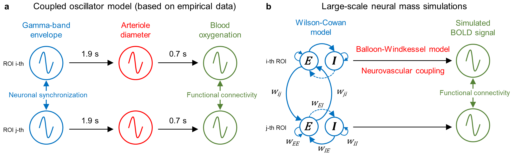

Gamma-band oscillations are linked to sensory processing[1](https://doi.org/10.1152/jn.2002.87.6.2715),[2](https://doi.org/10.1523/JNEUROSCI.5052-05.2006), motor acts[3](https://doi.org/10.1126/science.1107027), and cognitive processes[4](https://doi.org/10.1038/35094565),[5](https://doi.org/10.1146/annurev.neuro.051508.135603) and are thought to underlie information processing and transmission[6](https://doi.org/10.1016/j.neuron.2015.09.034),[7](https://doi.org/10.1038/nn.4569). The spectral power (or envelope) of gamma-band oscillations fluctuates very slowly with time, and brain regions with shared function demonstrate co-fluctuation of gamma-band envelopes[8](https://doi.org/10.1093/cercor/13.4.422),[9](https://doi.org/10.1038/nn.2177). Animal and human studies have shown that local field potential power in the gamma band is the closest electrophysiological correlate of spontaneous and evoked BOLD signals[9](https://doi.org/10.1038/35084005),[10](https://doi.org/10.1126/science.1110948),[11](https://doi.org/10.1016/j.cub.2007.06.066),[12](https://doi.org/10.1002/hbm.20580),[13](https://doi.org/10.1073/pnas.0913110107).

[Mateo et al. (2017)](https://doi.org/10.1016/j.neuron.2017.10.012) appplied optogenetic manipulations and concurrently measured local field potential, arteriole diameter and blood oxygenation in awake mice. They provided direct evidence that an increase in gamma-band power leads to an increase in arteriole diameter, and an increase in arteriole diameter leads to an increase in blood oxygenation. In accordance with previous empirical observations, we observed strong correlations between simulated ultra-slow fluctuations of the gamma-band envelope and time-shifted BOLD signal:

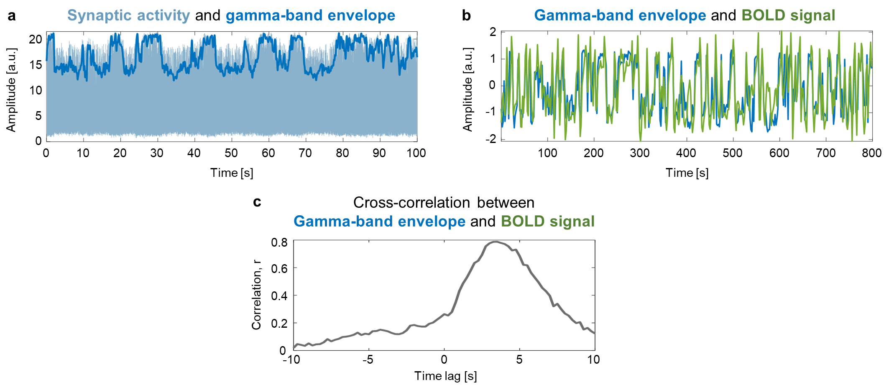

The simulation procedure included five steps:
  
1. Simulation of **gamma-band oscillatory neuronal activity** for 100 interconnected brain regions using **Wilson-Cowan equations**. Synaptic weights between 100 brain regions depend on the task conditions, which allow to control the ground-truth TMFC. Transient activity-dependent modulation of synaptic strength, lasting from tens of milliseconds to several minutes, is referred to as short-term synaptic plasticity[14](https://doi.org/10.1146/annurev.physiol.64.092501.114547),[15](https://doi.org/10.1016/j.neuroimage.2009.11.015),[16](https://doi.org/10.1101/cshperspect.a005702).
   
2. Simulation of **simple co-activations** using box-car functions. Co-activations are simultaneous activations (task-evoked hemodynamic responses) without communication between brain regions.

3. Using the **Balloon-Windkessel haemodynamic model** to convert oscillatory neuronal activity and co-activations into **BOLD signals**.

4. **Downsampling** of the BOLD signal to different time resolutions.

5. Adding white **Gaussian noise** to model scanner measurement error. This step was done in MATLAB (see [MATLAB_code](matlab_code) folder).

BOLD signal related to co-activations was normalised such that the ratio between the standard deviations of the oscillatory-related signal and co-activation-related signal was determined by the scaling factor:
SF = σoscill/σcoact.

The signal-to-noise ratio (SNR) was defined as the ratio between the standard deviations of the signal and noise: SNR = σsignal/σnoise.

Tasks consisted of **two task conditions (A and B)** interleaved by **rest** periods. By default, we considered **symmetric** synaptic weight matrices: 

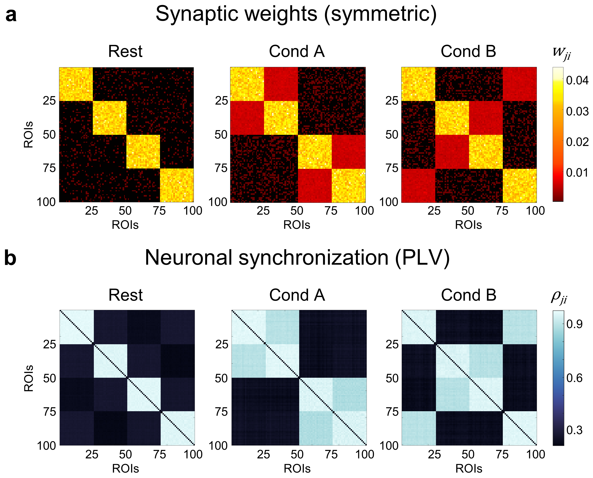

In the last simulation experiment, we used **asymmetric** synaptic weight matrices to test whether the gPPI method could be used to obtain at least some information about the direction of connectivity:

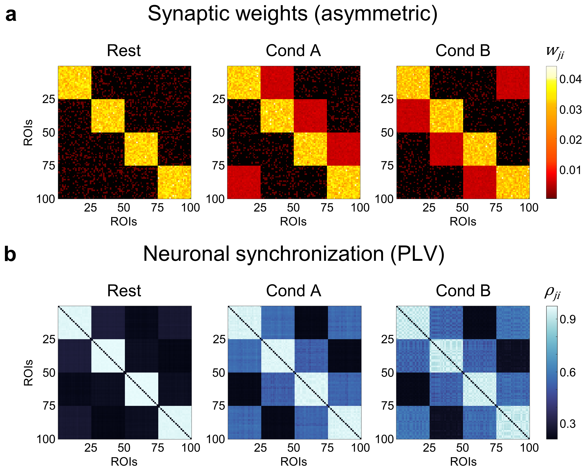

## TMFC Analysis

### Simulations without co-activations

We first considered simulations without co-activations (SF = 0) to investigate whether different TMFC methods produce FC matrices similar to ground-truth synaptic weight matrices for a sample size N = 100, SNR = 0.4, and TR = 2 s. **pFDR < 0.001.**

Correlation difference approach (**CorrDiff**):

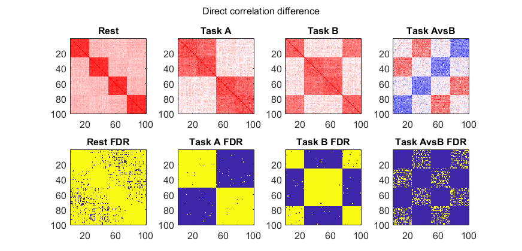

Standard psychophysiological interactions (**sPPI**) **with deconvolution** (with and without sPPI matrix symmetrisation):

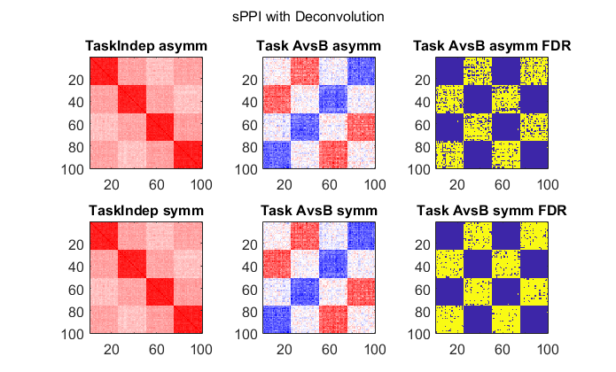

Standard psychophysiological interactions (**sPPI**) **without deconvolution** (with and without sPPI matrix symmetrisation):

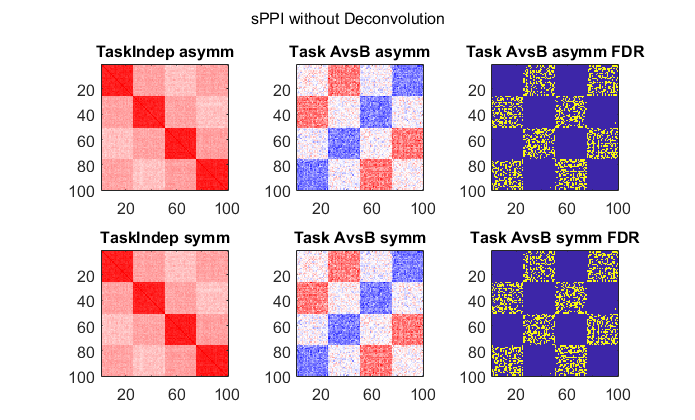

Generalised psychophysiological interactions (**gPPI**) **with deconvolution** (with and without gPPI matrix symmetrisation):

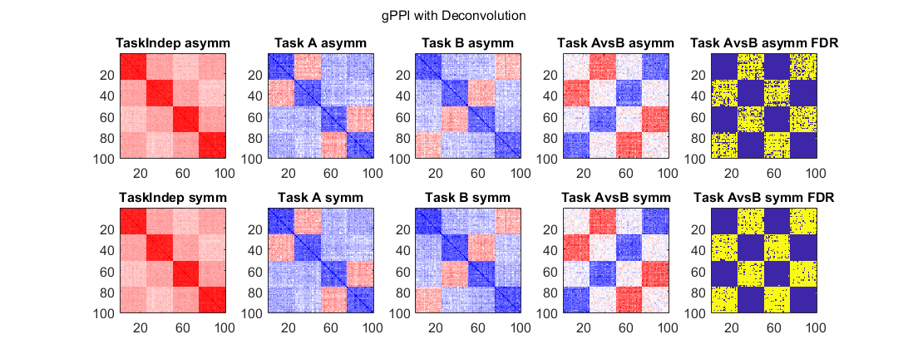

Generalised psychophysiological interactions (**gPPI**) **without deconvolution** (with and without gPPI matrix symmetrisation):

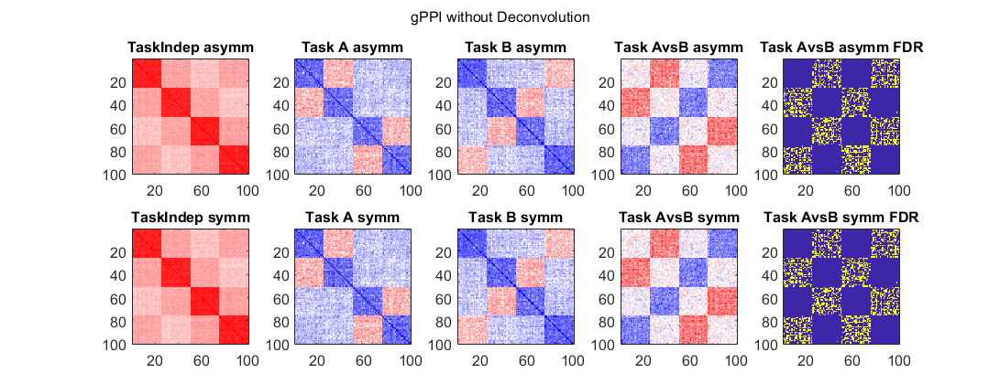

Beta-series correlations based on least-squares-all approach (**BSC-LSA**):

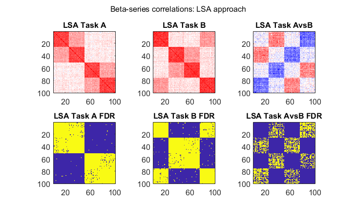

Beta-series correlations based on least-squares-separate approach (**BSC-LSS**):

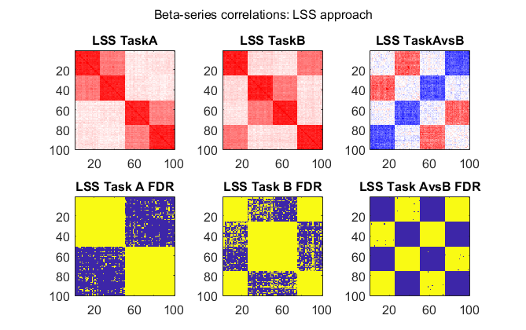

Beta-series correlations based on fractional ridge regression (**BSC-FRR**):

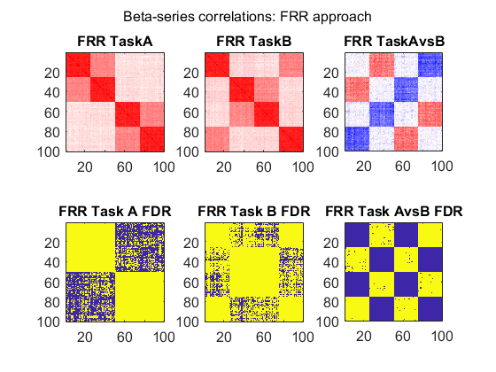

Correlational psychophysiological interactions (**cPPI**):

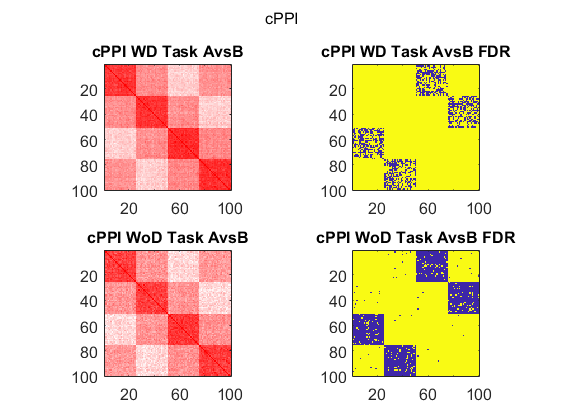

Task-state functional connectivity (**TSFC**) and background functional connectivity (**BGFC**):

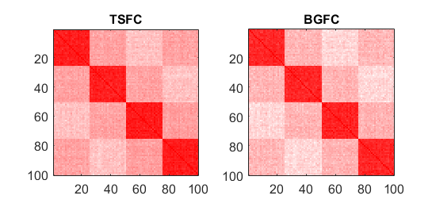

### Simulations with co-activations

Next, we considered simulations with co-activations (SF = 1) to investigate how different TMFC methods address artificial inflation of TMFC estimates due to simultaneous activation of brain regions without task-related modulation of synaptic weights between them:

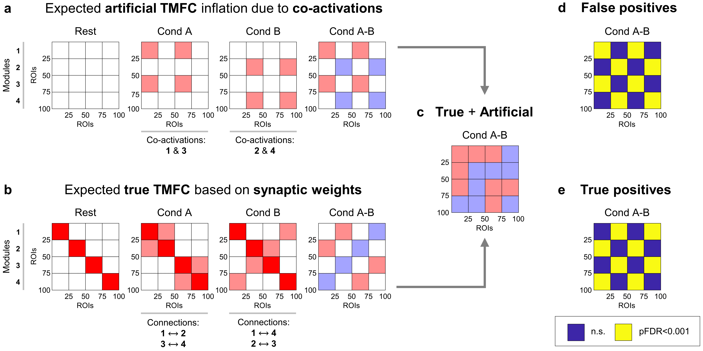

**gPPI without deconvolution** (e.g. gPPI without deconvolution is implemented in the FSL and CONN toolbox):

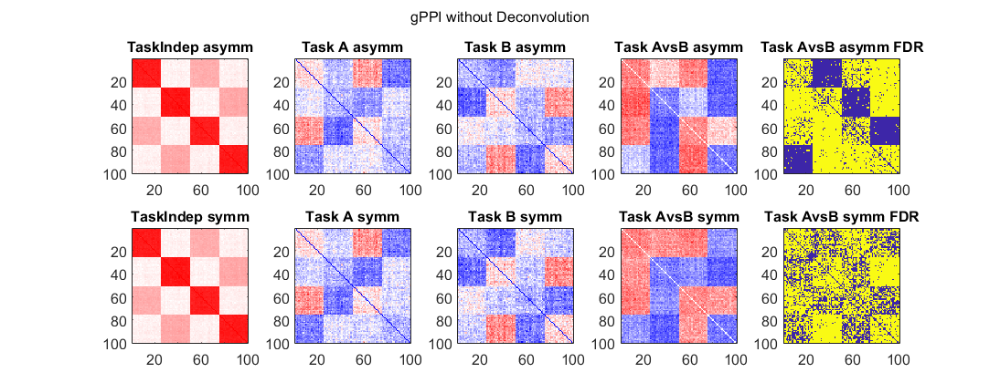

Here we can see that gPPI without deconvolution does not protect against co-activations.

To isolate TMFC from co-activation effects, we can **regress out task activations** using finite impulse response (FIR) functions prior to TMFC analysis. **FIR task regression** substantially improves gPPI specificity:

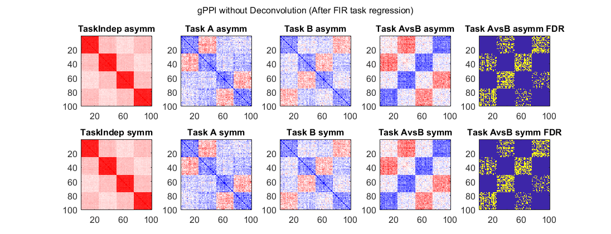

### Simulations with asymmetric synaptic weight matrices

Finally, we used **asymmetric** synaptic weight matrices to test whether the gPPI method has at least some causal interpretability. Asymmetric synaptic weight matrices should be reflected by **task-modulated effective connectivity (TMEC)**:

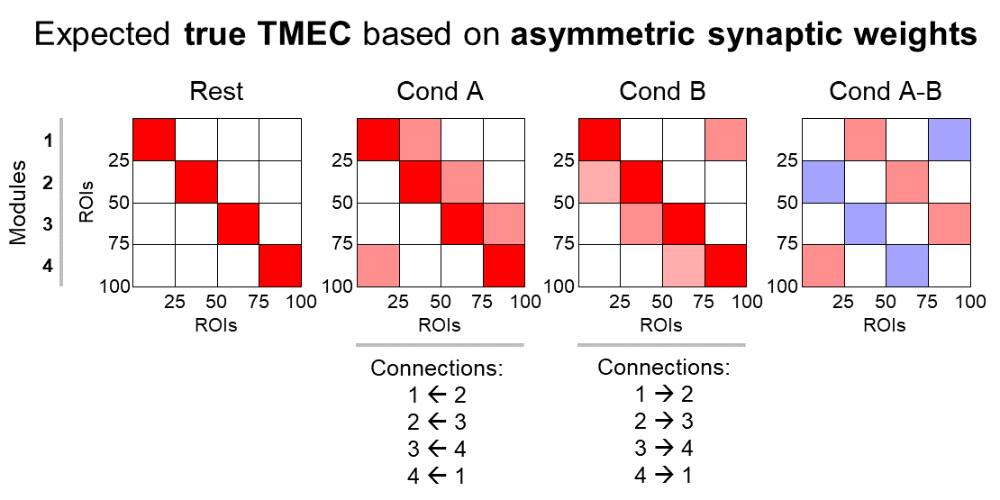

The **regression dynamic causal modelling (rDCM)** method (see **Note**), which is a conventional EC method, was used as a reference. As rDCM requires a relatively high SNR, we used SNR = 5 here. If the gPPI method is unable to correctly evaluate the direction of information flow at a high SNR, then it would also fail at lower SNRs.

Results for block design with twenty 20 s blocks per condition and SNR = 5:

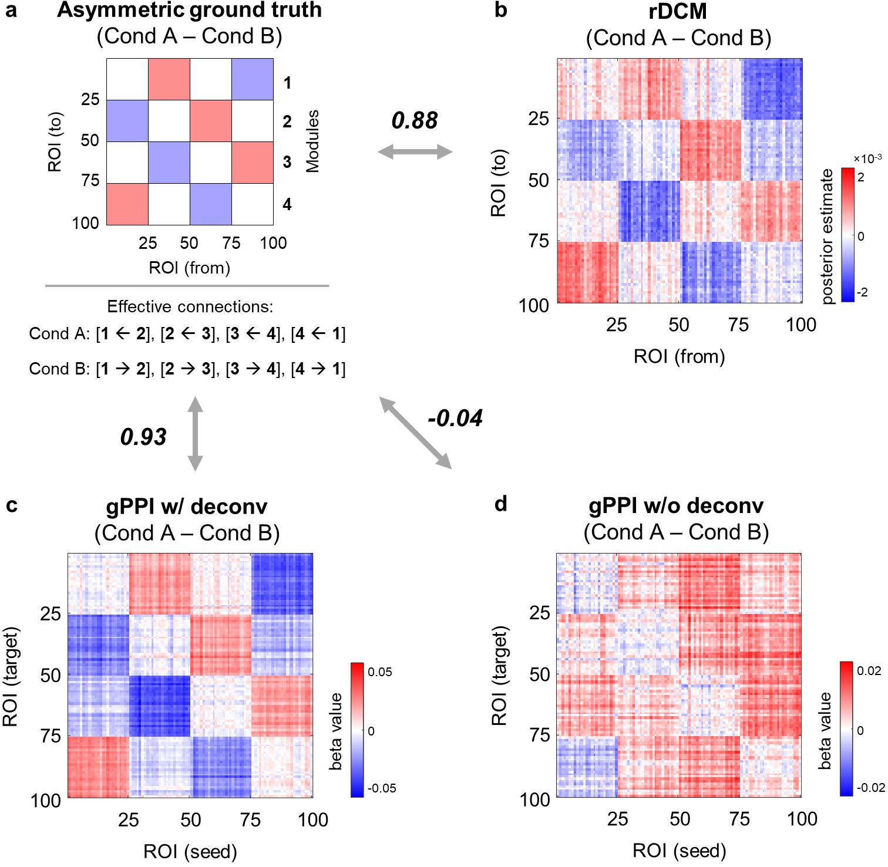

Here we can see that rDCM and gPPI with deconvolution are able to determine the effective strength of task-modulated synaptic connections at high SNR and long scan durations.

**Note:** Original DCM method enables us to estimate the effective strength of **task-independent (intrinsic)** synaptic connections **(A matrix)**, **task-modulated (extrinsic)** synaptic connections **(B matrix)**, and the direct influence of **driving inputs** that cause activations **(C matrix)**. The task-modulated effective connectivity (TMEC) matrix cannot be directly obtained using the rDCM approach because it is based on the linear neural state equation **without the B matrix**. If we feed the entire time series of the resting-state or task-state BOLD signal into rDCM, the A matrix will reflect the resting-state effective connectivity (RSEC) and task-state effective connectivity (TSEC) matrices, respectively. In the latter case, the A matrix will depend on both spontaneous (intrinsic) and task-modulated (extrinsic) oscillations. To calculate the TMEC matrix, we propose calculating two A matrices for concatenated “Cond A” and “Cond B” block time series after removing the first six seconds of each block. The difference between these matrices will subtract spontaneous (intrinsic) EC and result in TMEC.

